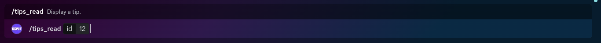
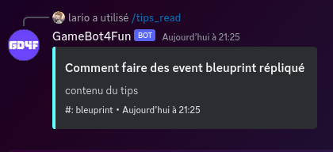
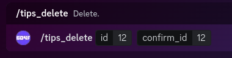
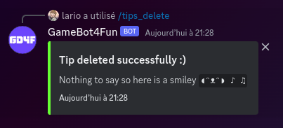
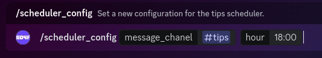
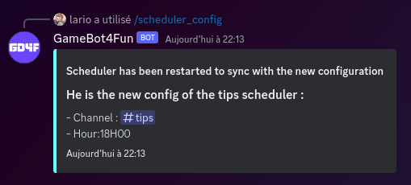
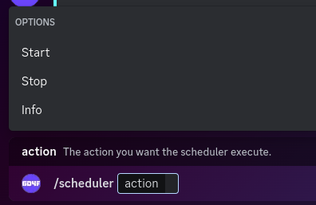
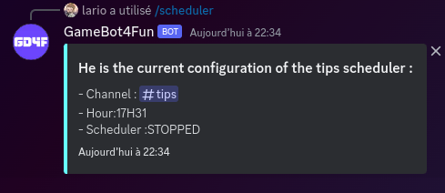
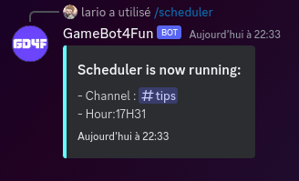
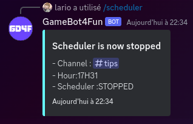

# GameBot4Fun
The GameBot4Fun bot is a small rust bot used on the GameDev4Fun discord to send daily tips. Maybe other feature will appear? Who knows?

## Features
- **Daily tips** : send a tips every day in a channel. You can create/read/update/delete tips and have a scheduler which you can configure like they want (channel of the daily tips, hour of the message).

## How to use it
1. First clone the repository on the machine that will host the bot.
2. Then build the project in release for better performance.
3. copy the `.env.exemple` file and rename it `.env`.
4. Fill every field with correct values
5. Run the script
6. That's it, you can now invite the bot to your server by clicking [the  link](https://discord.com/oauth2/authorize?client_id=1095468723944566904&permissions=277025508416&scope=bot).

---
## Daily Tips
> The bot will send a message every day containing advice for the GD4F community. Advice have some category and messages. They may contain link or images.`

1. use the `/scheduler_config` function with all parameters to initialize the configuration of the server.
2. start the tips scheduler by using the `/scheduler action:Start`.

### Tips commands
>##### /tips_list [\<str Tags>]:
> This command will show you the list of tips title already created.
> If tags are specified, it will show only tips that have one of these tags.
>
> The format of tags given as parameter of this command should be lowercase csv value like following with no spaces around coma : tag1,tag2,tag3,...
>
> **Example of usage :**
>
> 
> 

>##### /tips_create \<str Title> \<str Content> [\<str Tags>]:
> This command will create a new tips.
>
> The format of tags given as parameter of this command should be lowercase csv value like following with no spaces around coma : tag1,tag2,tag3,...
> 
> **Example of usage :**
> 
> 
> >

>##### /tips_read \<int Id> :
> This command display the tip requested. It the same behavior as the daily tips shown by the bot.
>
> **Example of usage :**
> 
> 
> 

>##### /tips_update \<int Id> [\<str Title>] [\<str Content>] [\<str Tags>]:
> This command will allow you to update an already created tip. **/!\\** When you update a value (title, content,tags) the new value will override the old one.
> The format of tags given as parameter of this command should be lowercase csv value like following with no spaces around coma : tag1,tag2,tag3,...
> 
> **Example of usage :**
> 
> 
> 

>##### /tips_delete \<int Id> \<int Confirm_Id> :
> This command delete the tip requested from the database.
>
> **Example of usage :**
>
> 
> 

### Scheduler command
>##### /scheduler_config [\<Text-Channel Channel>] [\<str Hour>]:
> This command is used to set the configuration of the tips scheduler.
>
> The channel MUST be a text channel where the bot can write. use the #channelName notation. 
> The hour param should look like this : "12:20" to send every day at 12h20.
>
> **Example of usage :**
>
> 
> 

>##### /scheduler \<str Action>:
> This command is used to perform action on the tips scheduler. Here is the list of possible action :
>
> **Info** : Show the current configuration of the scheduler
> **Start** : Start in background the daily tips scheduler
> **Stop** : Stop the background scheduler.
>
> **Example of usage :**
>
> 
> 
> 
> 
