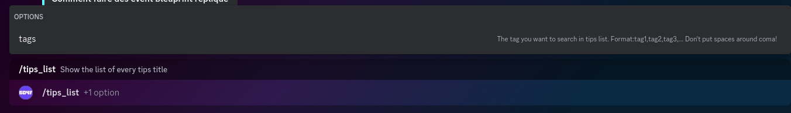
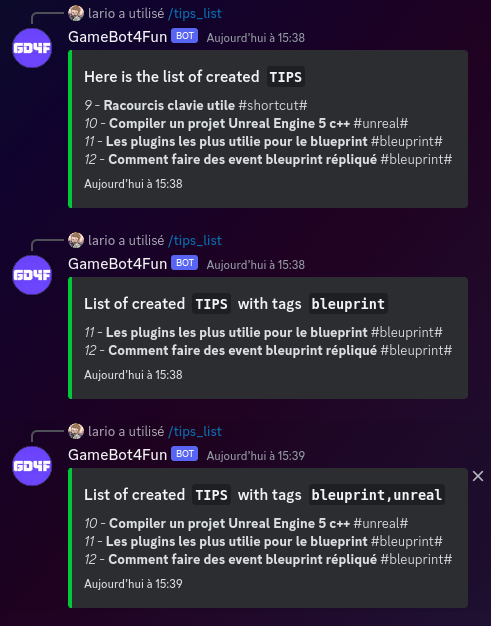
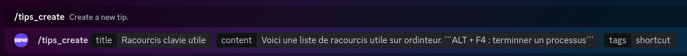
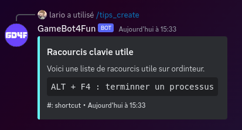
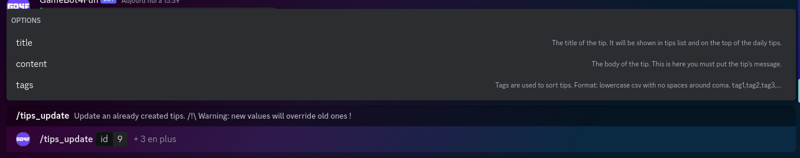
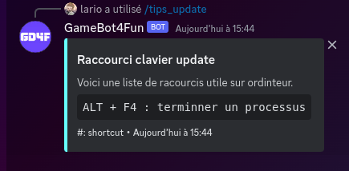

# GameBot4Fun
The GameBot4Fun bot is a small rust bot used on the GameDev4Fun discord to send daily tips
or send message for live announcement or other things like that.

## Features
1. Daily advice

### 1 - Daily tips
> The bot will send a message every day containing advice for the GD4F community. Advice have some category and messages. They may contain link or images.`

**
To manage tips there is the 5 following commands:
**

>##### /tips_list [\<str Tags>]:
> This command will show you the list of tips title already created.
> If tags are specified, it will show only tips that have one of these tags.
>
> The format of tags given as parameter of this command should be lowercase csv value like following with no spaces around coma : tag1,tag2,tag3,...
>
> **Example of usage :**
>
> 
> 

>##### /tips_create \<str Title> \<str Content> [\<str Tags>]:
> This command will create a new tips.
>
> The format of tags given as parameter of this command should be lowercase csv value like following with no spaces around coma : tag1,tag2,tag3,...
> 
> **Example of usage :**
> 
> 
> 

>##### /tips_update [\<str Tags>]:
> This command will allow you to update an already created tip. **/!\\** When you update a value (title, content,tags) the new value will override the old one.
> The format of tags given as parameter of this command should be lowercase csv value like following with no spaces around coma : tag1,tag2,tag3,...
> 
> **Example of usage :**
> 
> 
> 

* !tips create \<str Content> \<str Tags> : *Create a new tips*
* !tips delete \<int Id> : *Delete definitively the tips*

